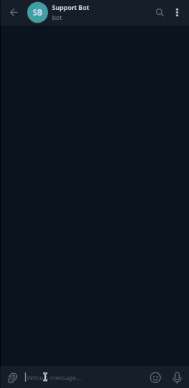
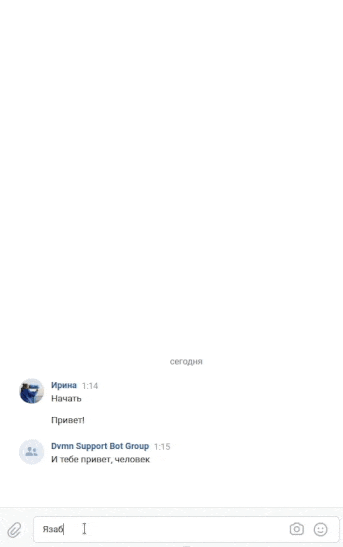

# Бот-помощник

Это бот для Телеграма и ВК, который умеет отвечать на типичные вопросы.

 

## Требования

Для запуска вам понадобится Python 3.6 или выше.

Необходимо зарегистрировать бота и получить токен для доступа к API Телеграма. Подробная инструкция [как зарегистрировать бота](https://way23.ru/%D1%80%D0%B5%D0%B3%D0%B8%D1%81%D1%82%D1%80%D0%B0%D1%86%D0%B8%D1%8F-%D0%B1%D0%BE%D1%82%D0%B0-%D0%B2-telegram/)

Также необходимо узнать ID чата, в который бот будет слать логи. Сделать это можно с помощью бота [Userinfobot](https://telegram.me/userinfobot). Отправьте боту любое сообщение, он в ответ пришлет ID.

В группе ВК, в меню справа находим пункт **Управление**, затем **Работа с API**, и создаем ключ доступа. Ключ понадобится чуть позже.
Далее идем **Сообщения ⟶ Настройки для бота** и включаем "Возможности ботов".

Для работы с Dialogflow понадобится:

- Создайте проект в Google Cloud и сохранить его id. Подробнее [здесь](https://cloud.google.com/dialogflow/es/docs/quick/setup#project).
- Создайте "агента", который будет отвечать на вопросы. При создании агента понадобится ввести id проекта из предыдущего пункта. Укажите язык агента "русский", иначе он вас не поймет. Подробнее [здесь](https://cloud.google.com/dialogflow/es/docs/quick/build-agent).
- Зарегистрируйте сервисный аккаунт для проекта и скачайте JSON-ключ. Подробнее [здесь](https://cloud.google.com/docs/authentication/getting-started).

## Подготовка

Скачайте код с GitHub. Установите зависимости:

```sh
pip install -r requirements.txt
```

## Переменные окружения

Настройки берутся из переменных окружения. Чтобы их определить, создайте файл `.env` в корне проекта и запишите туда данные в таком формате: `ПЕРЕМЕННАЯ=значение`.

Доступные переменные:

- `TG_BOT_TOKEN` — токен бота, который отправлять уведомления.
- `TG_CHAT_ID` — id чата, куда будут отправляться логи.
- `DIALOGFLOW_PROJECT_ID` — id проекта в Google Cloud, указанный при создании агента.
- `GOOGLE_APPLICATION_CREDENTIALS` — путь до файла с ключами для подключения к Google API.
- `VK_ACCESS_KEY` — ключ доступа к группе VK.
- `LOGGING_LEVEL` — уровень сообщений для логирования. По-умолчанию  `WARNING`, т.е. будут логироваться только предупреждения, ошибки и критические ошибки (`WARNING`, `ERROR`, `CRITICAL`). Для посмотра отладочных сообщений поставьте `DEBUG`.

Пример:

```env
TG_BOT_TOKEN=23052948:AAjh0e1U_vUkAZ0XZJUdfxjfUfwDLA0
TG_CHAT_ID=1234567
DIALOGFLOW_PROJECT_ID=example-project-157495
GOOGLE_APPLICATION_CREDENTIALS=/path/to/example-project-157495-32834a814fa6.json
VK_ACCESS_KEY=79a650716359a19ed9def1bb6172203e0b383a46c2ab089ba6dfebb88260d41145e9011
LOGGING_LEVEL=DEBUG
```

## Обучаем бота

Чтобы бот умел отвечать на вопросы по разным темам, его надо обучить.  
Создайте json-файл с вопросами и ответами по следующей схеме:

```json
{
    "Тема": {
        "questions": [
            "Вопрос 1",
            "Вопрос 2"
        ],
        "answer": "Ответ"
    },
    ...
}
```

Пример:

```json
{
    "Устройство на работу": {
        "questions": [
            "Как устроиться к вам на работу?",
            "Как работать у вас?",
            "Хочу работать у вас"
        ],
        "answer": "Если вы хотите устроиться к нам, напишите на почту."
    },
    "Забыл пароль": {
        "questions": [
            "Не помню пароль",
            "Не могу войти",
            "Проблемы со входом"
        ],
        "answer": "Если вы не можете войти на сайт, воспользуйтесь кнопкой «Забыли пароль?»"
    }
}
```

Запустите скрипт, чтобы обучить агента:

```bash
python dialogflow.py /path/to/questions.json 
```

В случае успешного выполнения скрипт ничего не выводит.

## Запуск

Запустите бота для ВК:

```sh
python vk.py
```

Для Телеграма:

```sh
python tg.py
```

В случае успешного старта скрипт ничего не выводит и запускает бесконечный цикл. Остановить можно командой `Ctrl+C`.

## Цели проекта

Код написан в учебных целях — для курса по Python на сайте [Devman](https://dvmn.org/modules/chat-bots/)
